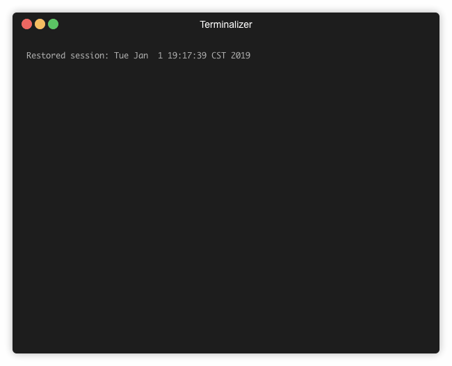

# renamed

A little Node utility to rename files in batch using your preferred text editor.



## Installation

```shell
npm install --global @mtusk/renamed
```

## Usage

1. Export
   ```shell
   renamed export
   ```
2. Modify names in output file in your favorite text editor
3. Import
   ```shell
   renamed import
   ```
